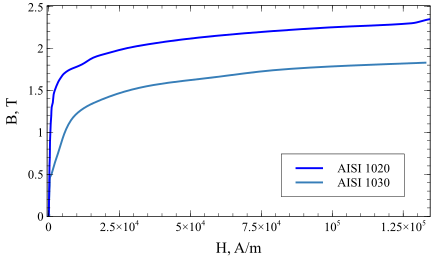

In simulation creation the correct material property definitions are vital to the precision and duration of the calculations. There are different ways to define thermal and electromagnetic properties of the materials, and some parameters are more sensitive to change than others.

## Input
In induction heating simulations, proper selection of magnetic properties has significant influence on both results and simulation time. As a user, you have several options on how to specify magnetic properties:

### Magnetic permeability - $\mu$ option

Magnetic permeability is required for all materials in electromagnetic simulation. Non-magnetic materials (air, aluminum, copper) have magnetic permeability $\mu_r = 1$. Ferromagnetic materials have $\mu_r > 1$.

### Non-linear magnetic material - *$B(H)$ option*

Permeability of magnetic materials depend on the magnetic field intensity *H*. This dependence is described by *B(H)* curve.
This curve can be used independently of the simulation setup, but calculation with *B(H)* curve takes significantly more time, especially for 3D geometries.
*B(H)* curve defines how magnetic flux density *B* changes in respect to magnetic field intensity *H*.

:::note
To use this option, check **Use B(H) model** in Material editing section.
:::

## Temperature dependence of magnetic properties

There are two options for including temperature dependence of magnetic properties in your simulation.

### $\mu(T)$ table

If exprimental data of magnetic permeability dependence on temperature is known, this option can be used. User has to input $\mu(T)$ as it is done also for other material properties. 

:::note
This option only works with $\mu$ option
:::

### Temperature correction

To account for temperature dependence, following function for relative magnetic permeability $\mu$ is used [1] :

$$
\mu(T) = 1 + \left(\mu_r - 1\right) \left( 1- \left(\frac{T}{T_C}\right)^{\beta} \right)
$$

Here $T_C$ is Curie temperature, $\beta$ is characteristic exponent for temperature dependence. The same equation applies also when *$B(H)$ option* is used.

$$
\mu(H, T) = 1 + \left(\mu_r(H) - 1\right) \left( 1- \left(\frac{T}{T_C}\right)^{\beta} \right)
$$

Here $\mu_r(H) = \frac{B(H)}{H\mu_0}$.
Characteristic exponent $\beta$ influences the shape of magnetic permeability temperature dependence. Higher $\beta$ means more rapid change of $\mu$ near Curie point (see Figure for explanation). Literature suggests different values for $\beta$. Early works [1] suggest $\beta = 2..4$. More recent works [2], [3] show that higher values ($\beta \approx 25$ ) allow modelling striation effect. For most cases recommended value is in the range $\beta = 4..6$.

.svg)

:::note
To use this option, check **Use temperature dependence** in Material editing section.
:::

### Treatment of non-linear magnetic properties in harmonic (AC) simulation

Magnetic field intensity change over period is not sinusoidal in ferromagnetic material. This restricts use of harmonic approach with non-linear magnetic materials. However, to account for nonlinear phenomena in time harmonic simulation, fictitious time independent material can be introduced. This approximation considers the conservation of the exchange of the magnetic energy along a period [4]:

$$
B_{eff}(H) = \frac{2}{H} \int_{0}^{H} B(H') d H'
$$

Here $H$ is the amplitude of the harmonic field, and $B(H')$ is the original magnetization curve.
Figure below shows magnetic flux density B at certain point in magnetic material. In transient calculation signal is not sinusoidal, and contains higher harmonics. For applications where higher harmonics can be neglected (also induction heating), effective B-H curve is suggested as it requires less computational resources. Especially important for induction heating applications - total power in both methods is very similar (differences below 5% in [5]).

It is important to remember that in harmonic simulations of non-linear magnetic materials, results may contain high magnetic flux density values which are well above saturation. This is normal, as this value is obtained with fictitious material.

.svg)

## References
[1] V.S. Nemkov, V.B. Demidovich.: Theory and Calculation of Induction Heating Devices. Leningrad, *Energoatomizdat*, 1988, p. 280. (in Russian).

[2] S.V. Dzliev, A.A. Zavorotkin , D.M. Zhnakin, K.E. Pischalev,  Yu.Yu. Perevalov.: Auto-oscillations in the scanning induction heating of magnetic steel, *Journal of Induction Heating*, 2013, No. 24. (in Russian).

[3] V.S. Nemkov, R. Goldstein.: Striation effect in induction heating: myths and reality, *COMPEL - The international journal for computation and mathematics in electrical and electronic engineering*, 2017, Vol. 36 Issue: 2, pp.504-517, https://doi.org/10.1108/COMPEL-05-2016-0189 

[4] H. Hedia, J.F. Remacle, P. Dular, A. Nicolet, A. Genon, W. Legros.: A sinusoidal
magnetic field computation in nonlinear materials, *IEEE Transactions on Magnetics*, 1995,  Vol. 31
No. 6, pp. 3527-9.

[5] G. Paoli, O. Bíró.: Time harmonic eddy currents in non-linear media, *COMPEL - The international
journal for computation and mathematics in electrical and electronic engineering*, 1998, Vol. 17 Issue: 5, pp.567-575, https://doi.org/10.1108/03321649810220865
