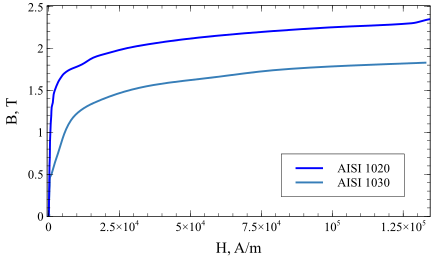

En la creación de simulaciones, las definiciones correctas de las propiedades de los materiales son vitales para la precisión y duración de los cálculos. Hay distintas formas de definir las propiedades térmicas y electromagnéticas de los materiales, y algunos parámetros son más sensibles a los cambios que otros.

## Entrada
En las simulaciones de calentamiento por inducción, la selección adecuada de las propiedades magnéticas tiene una influencia significativa tanto en los resultados como en el tiempo de simulación. Como usuario, tiene varias opciones sobre cómo especificar las propiedades magnéticas:

### Permeabilidad magnética - $\mu$ opción

La permeabilidad magnética es necesaria para todos los materiales en la simulación electromagnética. Los materiales no magnéticos (aire, aluminio, cobre) tienen una permeabilidad magnética $\mu_r = 1$. Los materiales ferromagnéticos tienen $\mu_r > 1$.

### Material magnético no lineal - opción *$B(H)$##.

La permeabilidad de los materiales magnéticos depende de la intensidad del campo magnético *H*. Esta dependencia se describe mediante la curva *B(H)*.
Esta curva puede utilizarse independientemente de la configuración de la simulación, pero el cálculo con la curva *B(H)* lleva mucho más tiempo, especialmente para geometrías 3D.
La curva *B(H)* define cómo cambia la densidad de flujo magnético *B* con respecto a la intensidad del campo magnético *H*.

:::note Nota

Para utilizar esta opción, marque **Utilizar modelo B(H)** en la sección Edición de materiales.

:::

## Dependencia de la temperatura de las propiedades magnéticas

Hay dos opciones para incluir la dependencia de la temperatura de las propiedades magnéticas en su simulación.

### $\mu(T)$ table

Si se conocen los datos experimentales de la dependencia de la permeabilidad magnética con la temperatura, se puede utilizar esta opción. El usuario tiene que introducir $\mu(T)$ como se hace también para otras propiedades de los materiales. 

:::note Nota

Esta opción sólo funciona con la opción $\mu$.

:::

### Corrección de la temperatura

Para tener en cuenta la dependencia de la temperatura, se utiliza la siguiente función para la permeabilidad magnética relativa $\mu$ [1] :

$$
\mu(T) = 1 + \left(\mu_r - 1\right) \left( 1- \left(\frac{T}{T_C}\right)^{\beta} \right)
$$

Aquí $T_C$ es la temperatura de Curie, $\beta$ es el exponente característico para la dependencia de la temperatura. La misma ecuación se aplica también cuando se utiliza la opción *$B(H)$*.

$$
\mu(H, T) = 1 + \left(\mu_r(H) - 1\right) \left( 1- \left(\frac{T}{T_C}\right)^{\beta} \right)
$$

Aquí $\mu_r(H) = \frac{B(H)}{H\mu_0}$.
El exponente característico $\beta$ influye en la forma de la dependencia de la temperatura de la permeabilidad magnética. Cuanto mayor sea $\beta$, más rápido será el cambio de $\mu$ cerca del punto de Curie (véase la explicación en la figura). La bibliografía sugiere distintos valores para $\beta$. Los primeros trabajos [1] sugieren $\beta = 2..4$. Trabajos más recientes [2], [3] muestran que valores más altos ($\beta \aprox 25$ ) permiten modelar el efecto de estriación. Para la mayoría de los casos, el valor recomendado está en el intervalo $\beta = 4..6$.

.svg)

:::note Nota

Para utilizar esta opción, marque **Usar dependencia de la temperatura** en la sección Edición de materiales.

:::

### Tratamiento de las propiedades magnéticas no lineales en la simulación armónica (CA)

El cambio de intensidad del campo magnético a lo largo del periodo no es sinusoidal en el material ferromagnético. Esto restringe el uso del enfoque armónico con materiales magnéticos no lineales. Sin embargo, para tener en cuenta los fenómenos no lineales en la simulación armónica temporal, puede introducirse un material ficticio independiente del tiempo. Esta aproximación considera la conservación del intercambio de la energía magnética a lo largo de un periodo [4]:

$$
B_{eff}(H) = \frac{2}{H} \int_{0}^{H} B(H') d H'
$$

Aquí $H$ es la amplitud del campo armónico, y $B(H')$ es la curva de magnetización original.
La figura siguiente muestra la densidad de flujo magnético B en un punto determinado del material magnético. En el cálculo transitorio, la señal no es sinusoidal y contiene armónicos superiores. Para aplicaciones en las que los armónicos superiores pueden despreciarse (también el calentamiento por inducción), se sugiere la curva B-H efectiva, ya que requiere menos recursos computacionales. Especialmente importante para aplicaciones de calentamiento por inducción: la potencia total en ambos métodos es muy similar (diferencias inferiores al 5% en [5]).

Es importante recordar que en las simulaciones armónicas de materiales magnéticos no lineales, los resultados pueden contener valores elevados de densidad de flujo magnético que están muy por encima de la saturación. Esto es normal, ya que este valor se obtiene con material ficticio.

.svg)

## References
[1] V.S. Nemkov, V.B. Demidovich.: Theory and Calculation of Induction Heating Devices. Leningrad, *Energoatomizdat*, 1988, p. 280. (in Russian).

[2] S.V. Dzliev, A.A. Zavorotkin , D.M. Zhnakin, K.E. Pischalev,  Yu.Yu. Perevalov.: Auto-oscillations in the scanning induction heating of magnetic steel, *Journal of Induction Heating*, 2013, No. 24. (in Russian).

[3] V.S. Nemkov, R. Goldstein.: Striation effect in induction heating: myths and reality, *COMPEL - The international journal for computation and mathematics in electrical and electronic engineering*, 2017, Vol. 36 Issue: 2, pp.504-517, https://doi.org/10.1108/COMPEL-05-2016-0189 

[4] H. Hedia, J.F. Remacle, P. Dular, A. Nicolet, A. Genon, W. Legros.: A sinusoidal
magnetic field computation in nonlinear materials, *IEEE Transactions on Magnetics*, 1995,  Vol. 31
No. 6, pp. 3527-9.

[5] G. Paoli, O. Bíró.: Time harmonic eddy currents in non-linear media, *COMPEL - The international
journal for computation and mathematics in electrical and electronic engineering*, 1998, Vol. 17 Issue: 5, pp.567-575, https://doi.org/10.1108/03321649810220865